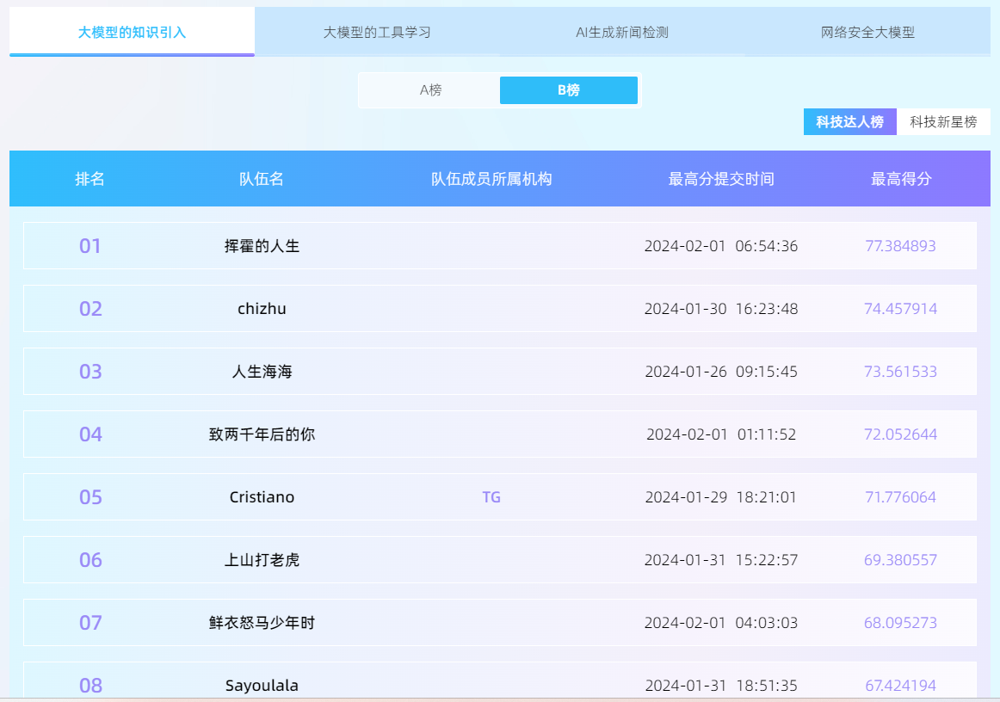
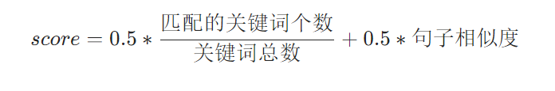
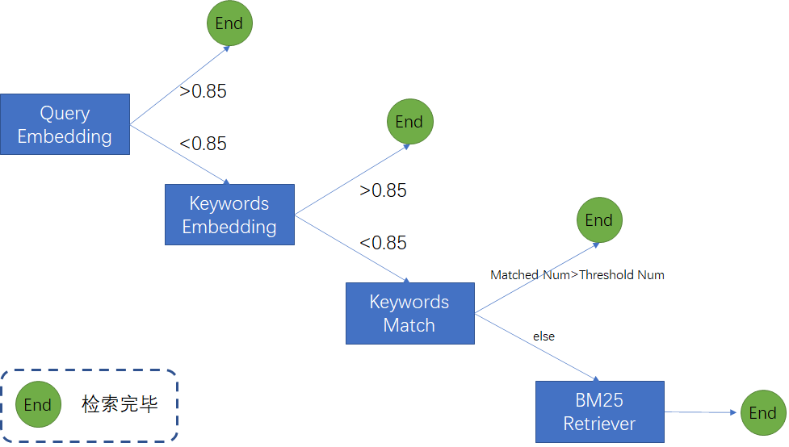
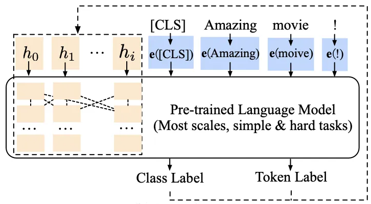

# ATEC2023-科技精英赛——赛道一：大模型的知识引入Rank7方案分享
**Created by 鲜衣怒马少年时（Ambrose） Rank 7**


## 📝赛题背景
知识引入是大模型落地的重要方向，一方面，对于基座大模型，通过引入特定的人类知识，可以提升大模型的安全性和真实性，缓解大模型的幻觉问题。另一方面，通过对基座通用大模型引入垂直领域知识，可以使大模型在更多垂直场景（医疗、金融等）得到更好的应用。本赛题以老年人在支付宝中常用的服务类场景（如出行、办事等）为切入点，探索借助知识引入的大模型，如何在耗能少效率高的基础上为老年人提供更便捷的服务。

## 📚赛题详情
- 本赛题将考察选手如何在给定基座大模型和待引入到大模型中的知识语料中，设计引入方式，提升引入知识后的大模型在评测数据集上的表现。以老年人在支付宝中常用的服务类场景（如出行、办事等）为切入点，探索借助知识引入的大模型，如何在耗能少效率高的基础上为老年人提供更便捷的服务
- 除了准确率外，引入知识后的大模型还需要特别关注安全性和真实性，对于一些容易造成安全或隐私诱导的输入，模型应当具备一定的拒识能力，对于引入的知识语料中不包含的知识，模型应避免胡编乱造。如果根据所有的内容都无法得出明确的结论，请回复“对不起，根据参考资料无法回答。”
- 基座大模型为标准Huggingface Transformer结构，选手可自行调整其权重。评测数据集为领域问答的形式，数据不公开，选手最终需要提交一个Huggingface格式的模型文件和解码相关参数，并按照要求制作最终提交的镜像，系统将会运行选手镜像对测试集预测并打分。

## 📢数据说明
1. 训练阶段提供的数据为民生相关的文档，例如：
```bash
"标题：老年社保卡怎么认证\n内容：第一步：登录国家社会保险公共服务平台（http://si.12333.gov.cn），点击“待遇资格认证”栏目中的“人脸识别认证”。\n第二步：打开“认证确认”页面，同意协议后开始认证。首次认证点击“开始认证”按钮，根据提示完成下载和安装，安装完成后，刷新或重启浏览器。\n第三步：阅读认证引导，按要求完成指定动作，认证完成后会自动跳转至认证结果。\n该平台提供代他人认证功能，操作方式相同。\n无法在此平台完成认证，也可以通过“掌上12333”APP、电子社保卡进行认证。"
```
2. 测试阶段为问答对，例如：
```bash
{
  "question": "老年卡在哪里办理老人认证",
  "answer": "认证方式：\n1.登录国家社会保险公共服务平台（http://si.12333.gov.cn），点击“待遇资格认证”栏目中的“人脸识别认证”。\n2.打开“认证确认”页面，同意协议后开始认证。首次认证点击“开始认证”按钮，根据提示完成下载和安装，安装完成后，刷新或重启浏览器。\n3.阅读认证引导，按要求完成指定动作，认证完成后会自动跳转至认证结果。该平台提供代他人认证功能，操作方式相同。\n无法在此平台完成认证，也可以通过“掌上12333”APP、电子社保卡进行认证。"
}
```
3. 在本赛题的测试中，可能出现以下三种类型的问答：
   - **基本问答**：参赛者提供的模型需要能根据用户问题，给出答案，并且保证答案的正确性、连贯性和帮助性，即答案能准确无误的解决用户问题
   - **拒绝回答**：参赛者提供的模型，需要能够判断给定的语料是否能解答用户问题，不能编造答案。如果根据所有的内容都无法得出明确的结论，需要回复“对不起，根据参考资料无法回答。”。
   - **推理问答**：参赛者提供的模型，需要具备一定的常识推理能力，例如语料提供的是一个比较宽泛的政策，而用户的问题相对比较具体，模型需要能判断出用户的问题是否能被政策所覆盖。

## 🤖评分规则
本赛道采用关键词和相似度计算作为评估指标， 两者加权得到最终得分。
- 其中关键词为每道题回答具体问题需要包含的信息，每道题的答案可能包含一到多个关键词，通过计算选手的结果中包含关键词的个数计分，全部答对得满分，部分答对按照比例计分。
- 相似度采用BLEU(采用sacreBleu算法的综合分)的计算方式进行计分。
- 关键词和相似度按照固定比例进行加权进行标准化，得到每题的得分，总分为所有题目的加总平均。
- 注意：如果出现需要拒绝回答的问题，需要回答“对不起，根据参考资料无法回答。”，如果回答非此答案的内容则不得分。



## 💡解题思路
显而易见，该赛题考察大模型的知识引入。常用的方法为RAG（Retrieval-Augmented Generation）+ 大模型微调。
1. **检索增强生成（Retrieval-Augmented Generation，RAG）**：
由于该赛题无法使用外部预训练模型（huggingface）和外部数据，因此无法直接套用langchain中的RAG实现方法。因此，我们参考langchain中的RAG实现流程，针对该赛题的数据设计并实现了RAG算法。其中相似文档组合检索流程如下：


除此之外，我们还设计了特定的prompt，并基于此修改dev.jsonl文件，得到修改后的dev_new.jsonl文件作为后续模型微调的数据。其中，prompt如下：
   ```bash
   template = '''根据以下参考文档和问题，给出对应的答案。如果参考文档明确指出问题答案，请给出答案并保证答案的正确性、连贯性和完整性。如果根据参考文档无法得出明确的答案，请回答“对不起，根据参考资料无法回答。”。答案字数限定在512以内，仅回答与问题相关的答案即可。
   问题: {question}
   参考文档: {summaries}
   答案:
   '''
   ```

   2. **大模型微调**：本赛题以ChatGLM2-6B作为基座模型，可选择的微调方法有：全量微调、部分微调（冻结部分模型层）、LoRA、P-Tuning等。考虑到赛题训练资源限制，选择P-Tuning v2作为微调方法。（注：LoRA并未进行实验验证），其中P-Tuning v2的原理如下：
   
   

   微调数据如下：
   ```bash
   {
      "id": "f4050784-f64f-451a-b2c9-e30812c18c7d",
      "question": "根据以下参考文档和问题，给出对应的答案。如果参考文档明确指出问题答案，请给出答案并保证答案的正确性、连贯性和完整性。如果根据参考文档无法得出明确的答案，请回答“对不起，根据参考资料无法回答。”。答案字数限定在512以内，仅回答与问题相关的答案即可。
                  问题: 什么是蚂蚁庄园
                  参考文档: 蚂蚁庄园是一款基于支付宝支付行为的农场养成游戏。
                  答案: ",
      "answer": "蚂蚁庄园是一款基于支付宝支付行为的农场养成游戏。"
   }
   ```

## 🌟代码运行说明
```bash
# 模型微调
bash run.sh

# 模型推理
cd src
python RAG.py
```

## 🎉总结
大模型知识注入目前主流的方法为RAG+微调。
- RAG通过外挂知识库的方式，限定了参考文献范围，极大地缓解了大模型的幻觉问题。其中相似文档的检索准确性决定了模型回答的好坏，因此提高相似文档检索的召回率是该赛题的关键。
- 此外，通过微调使得模型通过少量样本学习领域知识与问题作答方式，提高模型回答的准确性。然而大模型微调存在致命的缺陷：大模型通用能力会随模型微调而下降。
- 由于赛题数据不允许外传，如有需要可以邮箱：glzhao0825@gmail.com